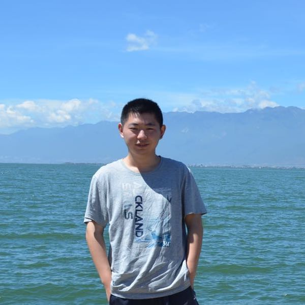
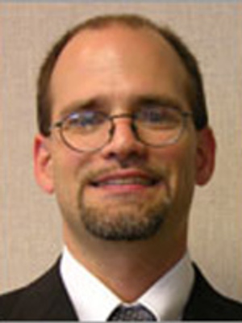
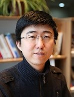
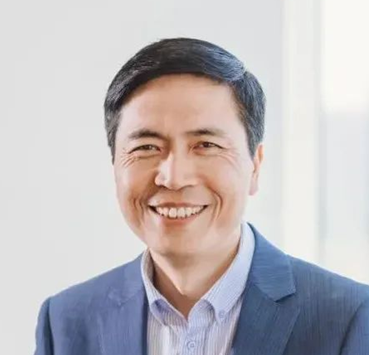
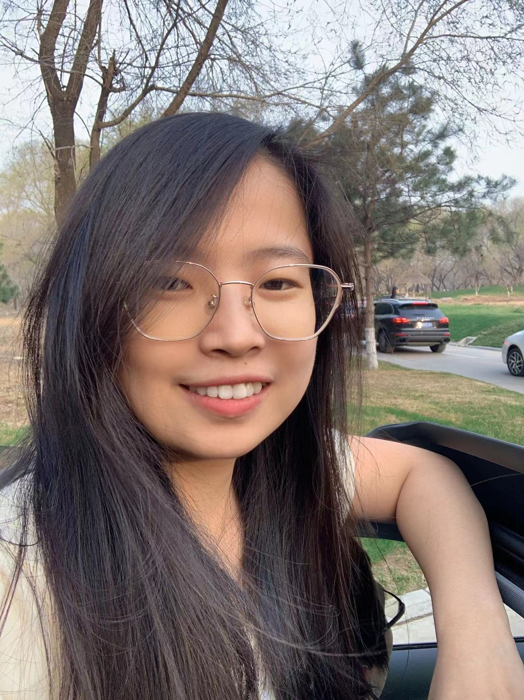
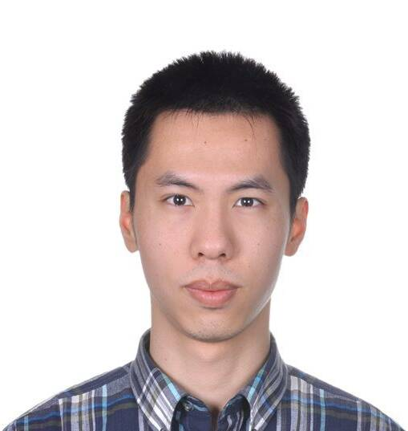

### Invited Speakers

<speaker>
    <table>
        <tbody>
        <tr>
            <td width="25%"></td>
            <td width="25%"></td>
            <td width="25%"></td>
        </tr>
        <tr>
            <td><a href="https://sy-zhang.github.io/">Songyang Zhang   (University of Rochester)</a></td>
            <td><a href="https://www.asc.ohio-state.edu/schuler.77/?_gl=1*ulhd76*_ga*MjI2MDQ2NTQuMTYzNDg2NjI1Ng..*_ga_09WC99HMPE*MTYzNDg2NjM5MS4xLjAuMTYzNDg2NjM5MS4w">William Schuler (OSU)</a></td>
            <td><a href="http://web.cs.ucla.edu/~kwchang/">Kai-Wei Chang (UCLA)</a></td>              
        </tr>
        <tr>
            <td width="25%"></td>
            <td width="25%"></td>
            <td width="25%"></td>
        </tr>
        <tr>
            <td><a href="http://faculty.sist.shanghaitech.edu.cn/faculty/tukw/">Kewei Tu   (ShanghaiTech University)</a></td>            
            <td><a href="https://web.eecs.umich.edu/~chaijy/">Joyce Y. Chai (UMich)</a></td>              
            <td><a href="http://www.stat.ucla.edu/~sczhu/"> Song-Chun Zhu (BIGAI)</a></td>
        </tr>
        </tbody>
    </table>
</speaker>

### Schedule

| Time | Speaker | Description |
| --- | ----------- | ---------------------- |
| 10:00 - 10:15 |  | Opening Remark |
| 10:15 - 10:30 |  | TBD |

### Overview

Induction of structures (IoS) is the process of inducing structured objects (a general term of structured data rather than discrete or real values) from a set of observations. It is a branch of machine learning where the output space consists of discrete combinatorial objects (such as strings, trees, and graphs) and is unobserved or partially observed during learning. IoS in natural language processing has often been very focused on the problem of uncovering the syntactic structure (*e.g.*, a constituent or dependency tree), semantic structure, label sequence, discourse structure etc from input text. Such structures have been found useful in downstream tasks such as relation extraction and machine translation. Apart from the wide usage in language, inducing the underlying structures from raw sensory inputs (*e.g.*, vision) has been a long-standing challenge in the field of artificial intelligence.

$\color{rgb(255,255,0)}{This workshop will be virtual.}$

### Organizers

<speaker>
    <table>
        <tbody>
        <tr>
            <td width="25%"></td>
            <td width="25%"></td>
            <td width="25%"></td>
            <td width="25%"></td>
        </tr>
        <tr>
            <td><a href="http://hanwenjuan.com/">Wenjuan Han (BIGAI)</a></td>              
            <td><a href="https://zilongzheng.github.io/">Zilong Zheng (BIGAI)</a></td>
            <td><a href="https://lifengjin.github.io/">Lifeng Jin (OSU)</a></td>
            <td><a href="https://scholar.google.com/citations?user=qff5rRYAAAAJ&hl=en">Yikang Shen (Mila)</a></td>
        </tr>
        <tr>
            <td width="25%"></td>
            <td width="25%"></td>
            <td width="25%"></td>
        </tr>
        <tr>
            <td><a href="https://hantek.github.io/">Zhouhan Lin (SJTU)</a></td>
            <td><a href="https://people.csail.mit.edu/yoonkim/"> Yoon Kim (MIT)</a></td>
            <td><a href="http://faculty.sist.shanghaitech.edu.cn/faculty/tukw/">Kewei Tu   (ShanghaiTech University)</a></td>
        </tr>
        </tbody>
    </table>
</speaker>
