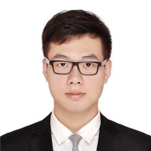

### Invited Speakers

<speaker>
    <table>
        <tbody>
        <tr>
            <td width="25%"></td>
            <td width="25%"></td>
        </tr>
        <tr>
            <td><a href="https://sy-zhang.github.io/">Songyang Zhang (University of Rochester)</a></td>
            <td><a href="https://freesunshine0316.github.io/">Linfeng Song (Tencent AI Lab)</a></td>
        </tr>
        <tr>
            <td width="25%"></td>
            <td width="25%"></td>
        </tr>
        <tr>
            <td><a href="http://web.cs.ucla.edu/~kwchang/">Kai-Wei Chang (UCLA)</a></td>              
            <td><a href="http://www.stat.ucla.edu/~sczhu/"> Song-Chun Zhu (BIGAI)</a></td>
        </tr>
        </tbody>
    </table>
</speaker>

### Schedule

| Time | Speaker | Description |
| --- | ----------- | ---------------------- |
| 10:00 - 10:15 | Song-Chun Zhu | Opening Remark |

### Overview

Induction of Structure (IoS) is the process of inducing structured objects (a general term of structured data rather than scalar discrete or real values) from a set of observations, thus constructing a model which accounts for the characteristics of the observed objects. More generally in the current stage, IoS is a branch of machine learning where the instance space consists of discrete combinatorial objects such as strings, trees, and graphs.
IoS in natural language processing has often been very focused on the problem of uncovering the syntactic structure (*e.g.*, a constituent or dependency tree), semantic structure, sequence labeling, discourse structure etc from input text. Such structures have been found useful in downstream tasks such as relation extraction, and machine translation. 
Apart from the wide usage in language, inducing the underlying structures and grammars from raw sensory inputs, *e.g.* vision and language has been a long-standing challenge in the field of artificial intelligence.

### Organizers

<speaker>
    <table>
        <tbody>
        <tr>
            <td width="25%"></td>
            <td width="25%"></td>
            <td width="25%"></td>
            <td width="25%"></td>
        </tr>
        <tr>
            <td><a href="http://hanwenjuan.com/">Wenjuan Han* (BIGAI)</a></td>              
            <td><a href="https://zilongzheng.github.io/">Zilong Zheng* (BIGAI)</a></td>
            <td><a href="https://hantek.github.io/">Zhouhan Lin (SJTU)</a></td>
            <td><a href="https://scholar.google.com/citations?user=qff5rRYAAAAJ&hl=en">Yikang Shen (Mila)</a></td>
        </tr>
        <tr>
            <td width="25%"></td>
            <td width="25%"></td>
            <td width="25%"></td>
        </tr>
        <tr>
            <td><a href="https://people.csail.mit.edu/yoonkim/"> Yoon Kim (MIT)</a></td>
            <td><a href="http://faculty.sist.shanghaitech.edu.cn/faculty/tukw/">Kewei Tu (ShanghaiTech University)</a></td>
            <td><a href="https://web.eecs.umich.edu/~chaijy/">Joyce Y. Chai (UMich)</a></td>              
        </tr>
        </tbody>
    </table>
</speaker>